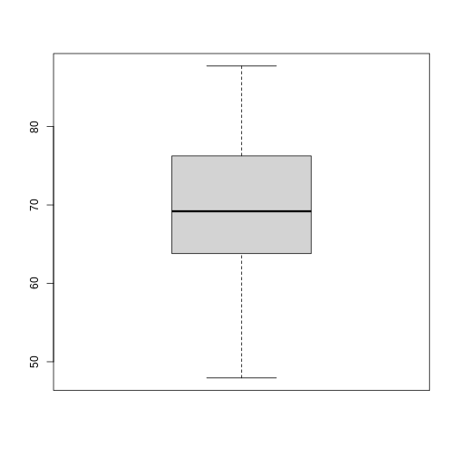
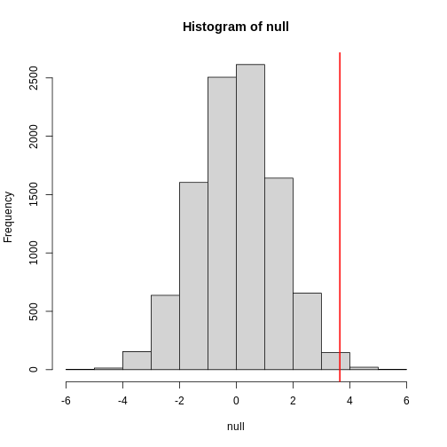
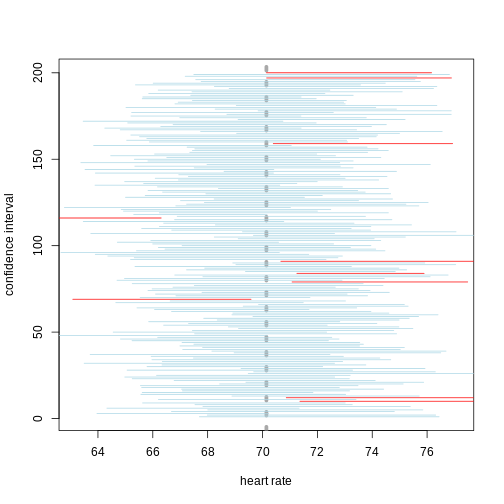

::::::::::::::::::::::::::::::::::::::: objectives

- Plotting reveals information in the data.
- Statistical significance testing compares experimental data obtained to probability distributions of data that might also be possible.
- A probability distribution is a mathematical function that gives the probabilities of different possible outcomes for an experiment.

::::::::::::::::::::::::::::::::::::::::::::::::::

:::::::::::::::::::::::::::::::::::::::: questions

- How can information be extracted and communicated from experimental data?

::::::::::::::::::::::::::::::::::::::::::::::::::


## A picture is worth a thousand words

To motivate this next section on statistics, we start with an example of human
variability. This 1975 living histogram of women from the University
of Wisconsin Madison shows variability in a natural population.

{alt='living histogram of female student heights'}

[B. Joiner, Int'l Stats Review, 1975](https://personal.psu.edu/drh20/talks/joiner_living_histograms.pdf)

:::::::::::::::::::::::::::::::::::::::  challenge

## Exercise 1: A living histogram

From the living histogram, can you estimate by eye   
1\). the mean and median heights of this sample of women?  
2\). the spread of the data? Estimate either standard deviation or variance by
eye. If you're not sure how to do this, think about how you would describe the
spread of the data from the mean. You do not need to calculate a statistic.  
3\). any outliers? Estimate by eye - don't worry about calculations.  
4\). What do you predict would happen to mean, median, spread and outliers if
an equal number of men were added to the histogram?

:::::::::::::::  solution

## Solution to Exercise 1

1\). Mean and median are two measures of the center of the data. The median
is the 50th% of the data with half the women above this value and
the other half below. There are approximately 100 students total. Fifty of
them appear to be above 5 feet 5 inches and fifty of them appear to be below
5'5". The median is not influenced by extreme values (outliers), but the
mean value is. While there are some very tall and very short people, the
bulk of them appear to be centered around a mean of 5 foot 5 inches with
a somewhat longer right tail to the histogram.
2\). If the mean is approximately 5'5" and the distribution appears normal
(bell-shaped), then we know that approximately 68% of the data lies within
one standard deviation (sd) of the mean and ~95% lies within two sd's. If
there are ~100 people in the sample, 95% of them lie between 5'0" and 5'10"
(2 sd's = 5" above and 5" below the mean). One standard deviation then would
be about 5"/2 = 2.5" from the mean of 5'5". So 68% of the data (~68 people)
lie within 5 feet 2.5 inches and 5 feet 7.5 inches.
3\). There are some very tall and very short people but it's not clear
whether they are outliers. Outliers deviate significantly from expected
values, specifically by more than 3 standard deviations in a normal
distribution. Values that are greater than 3 sd's (7.5") above or below the
mean could be considered outliers. Outliers would then be shorter than 4
feet 7.5 inches or taller than 6 feet 2.5 inches. The shortest are 4 feet 9
inches and the tallest 6' 0 inches. There are no outliers in this sample
because all heights fall within 3 sd's.
4\). Average heights for men are greater than average heights for women, so you
could expect that a random sample of 100 men would increase the average height 
of the sample of 200 students. The mean would shift to the right of the 
distribution toward taller heights, as would the median.

:::::::::::::::::::::::::

::::::::::::::::::::::::::::::::::::::::::::::::::

## The first step in data analysis: plot the data!

A picture is worth a thousand words, and a picture of your data could reveal
important information that can guide you forward. So first, plot the data!


```r
# read in the simulated heart rate data
heart_rate <- read.csv("data/heart_rate.csv")

# take a random sample of 100 and create a histogram
# first set the seed for the random number generator
set.seed(42)
sample100 <- sample(heart_rate$heart_rate, 100)
hist(sample100, xlab = "resting heart rate for 100 participants")
```



:::::::::::::::::::::::::::::::::::::::  challenge

## Exercise 2: What does this picture tell you about resting heart rates?

Do the data appear to be normally distributed? Why does this matter?
Do the left and right tails of the data seem to mirror each other or not?
Are there gaps in the data?
Are there large clusters of similar heart rate values in the data?
Are there apparent outliers?
What message do the data deliver in this histogram?

:::::::::::::::  solution

## Solution to Exercise 2

:::::::::::::::::::::::::

::::::::::::::::::::::::::::::::::::::::::::::::::

Now create a boxplot of the same sample data.


```r
boxplot(sample100)
```


:::::::::::::::::::::::::::::::::::::::  challenge

## Exercise 3: What does this boxplot tell you about resting heart rates?

What does the box signify?
What does horizontal black line dividing the box signify?
Are there apparent outliers?
How does the boxplot relate to the histogram?
What message do the data deliver in this boxplot?

:::::::::::::::  solution

## Solution to Exercise 3

:::::::::::::::::::::::::

::::::::::::::::::::::::::::::::::::::::::::::::::

Plotting the data can identify unusual response measurements (**outliers**),
reveal relationships between variables, and guide further statistical analysis.
When data are not normally distributed (bell-shaped and symmetrical), many of
the statistical methods typically used will not perform well. In these cases
the data can be transformed to a more symmetrical bell-shaped curve.

## Random variables

The Generation 100 study aims to determine whether high-intensity exercise in
elderly adults affects lifespan and healthspan.


```r
# heart_rate ~ exercise_group is a formula indicating that the response (heart
# rate) is dependent on the treatment (exercise group)
boxplot(heart_rate ~ exercise_group, data = heart_rate)
```


:::::::::::::::::::::::::::::::::::::::  challenge

## Exercise 4: Comparing two groups - control vs. high intensity

1. Does there appear to be a significant heart rate difference between the
  control and high intensity exercise groups? How would you know?
2. Do any of the data overlap between the two boxplots?
3. Can you know which exercise group a person belongs to just by knowing their
  heart rate? For example, for a heart rate of 80 could you say with certainty
  that a person belongs to one group or the other?

:::::::::::::::  solution

## Solution to Exercise 4

1. There appears to be a trend of lower heart rate in the high-intensity
  exercise group, however, we can't say whether or not it is significant
  without performing statistical tests.
2. There is considerable overlap between the two groups, which shows that
  there is considerable variability in the data.
3. Someone with a heart rate of 80 could belong to any group. When
  considering significance of heart rate differences between the two groups
  we don't look at individuals, rather, we look at averages between the two
  groups.


:::::::::::::::::::::::::

::::::::::::::::::::::::::::::::::::::::::::::::::

The boxplots above show a trend of lower heart rate in the high-intensity
exercise group and higher heart rate in the control exercise group. There
is inherent variability in heart rate in both groups however, which is to be
expected. That variability appears in the box and whisker lengths of the
boxplots, along with any outliers that appear as hollow circles outside of the
whisker length. This variability in heart rate measurements also means that the
boxplots overlap between the two groups, making it difficult to determine 
whether there is a significant difference in mean heart rate between the groups.

We can calculate the difference in means between the two groups to answer the
question about exercise intensity.


```r
# calculate the means of the two groups
# load the tidyverse library to write more easily interpreted code
library(tidyverse)

HI <- heart_rate %>% filter(exercise_group == "high intensity")
control <- heart_rate %>% filter(exercise_group == "control")
meanDiff <- mean(control$heart_rate) - mean(HI$heart_rate)
```

The actual difference in mean heart rates between the two groups is
3.31. Another way of 
stating this is that the high-intensity group had a mean heart rate that was
5 
percent lower than the control group. This is the *observed effect size*.

So are we done now? Does this difference support the alternative hypothesis
that there is a significant difference in mean heart rates? Or does it fail to
reject the null hypothesis of no significant difference? Why do we need p-values
and confidence intervals if we have evidence we think supports our claim? The
reason is that the mean values are **random variables** that can take many
different values. We are working with two samples of elderly Norwegians, not the
entire population of elderly Norwegians. The means are **estimates** of the
true mean heart rate of the entire population, a number that we can never know
because we can't access the entire population of elders. The sample means will
vary with every sample we take from the population. To demonstrate this, let's
take a sample from each exercise group and calculate the difference in means
for those samples.


```r
# calculate the sample mean of 100 people in each group
HI100 <- mean(sample(HI$heart_rate, size = 100))
control100 <- mean(sample(control$heart_rate, size = 100))
control100 - HI100 
```

```{.output}
[1] 3.727775
```

Now take another sample of 100 from each group and calculate the difference in
means.


```r
# calculate the sample mean of 100 people in each group
HI100 <- mean(sample(HI$heart_rate, size = 100))
control100 <- mean(sample(control$heart_rate, size = 100))
control100 - HI100
```

```{.output}
[1] 3.095662
```

Are the differences in sample means the same? We can repeat this sampling again
and again, and each time arrive at a different value. The sample means are a
random variable, meaning that they can take on any number of different values.
Since they are random variables, the difference between the means (the 
*observed effect size*) is also a random variable.

Supposing we did have access to the entire population of elderly Norwegians. Can
we determine the mean resting heart rate for the entire population, rather than
just for samples of the population? Imagine that you have measured the resting 
heart rate of the entire population of elders 70 or older, not just the 1,567 
from the Generation 100 study. In practice we would never have access to the 
entire population, so this is a thought exercise.


```r
# read in the heart rates of the entire population of all elderly people
population <- rbind(HI, control)

# sample 100 of them and calculate the mean three times
mean(sample(population$heart_rate, size = 100))
```

```{.output}
[1] 69.84873
```

```r
mean(sample(population$heart_rate, size = 100))
```

```{.output}
[1] 69.85246
```

```r
mean(sample(population$heart_rate, size = 100))
```

```{.output}
[1] 71.79092
```

Notice how the mean changes each time you sample. We can continue to do this
many times to learn about the distribution of this random variable. Comparing
the data obtained to a *probability distribution* of data that might have been
obtained can help to answer questions about the effects of exercise intensity
on heart rate.

## The null hypothesis

Now let's return to the mean difference between treatment groups. How do we know
that this difference is due to the exercise? What happens if all do the same 
exercise intensity? Will we see a difference as large as we saw between the two 
treatment groups? This is called the null hypothesis. The word null reminds us 
to be skeptical and to entertain the possibility that there is no difference.

Because we have access to the population, we can randomly sample 100 controls to
observe as many of the differences in means when exercise intensity has no
effect. We can give everyone the same exercise plan and then record the
difference in means between two randomly split groups of 100 and 100.

Here is this process written in R code:


```r
## 100 controls
control <- sample(population$heart_rate, 100)

## another 100 controls that we pretend are on a high-intensity regimen
treatment <- sample(population$heart_rate, 100)
mean(control) - mean(treatment)
```

```{.output}
[1] 0.04872035
```

Now let's find the sample mean of 100 participants from each group 10,000 times.


```r
treatment <- replicate(n = 10000, mean(sample(population$heart_rate, 100)))
control <- replicate(n = 10000, mean(sample(population$heart_rate, 100)))
null <- control - treatment
hist(null)
abline(v=meanDiff, col="red", lwd=2)
```



`null` contains the differences in means between the two groups sampled 10,000
times each. The value of the observed difference in means between the two 
groups, `meanDiff`, is shown as a vertical red line. The values in `null` make 
up the **null distribution**. How many of these differences are greater than the 
observed difference in means between the actual treatment and control groups?


```r
mean(null >= meanDiff)
```

```{.output}
[1] 0.0074
```

Approximately 0.7% of the 10,000 
simulations are greater than the observed difference in means. We can expect 
then that we will see a difference in means approximately 
0.7% of the time even if there is no 
effect of exercise on heart rate. This is known as a **p-value**.

:::::::::::::::::::::::::::::::::::::::  challenge

## Exercise 5: What does a p-value mean?

What does this p-value tell us about the difference in means between the two
groups? How can we interpret this value? What does it say about the
significance of the difference in mean values?

:::::::::::::::  solution

## Solution to Exercise 5

:::::::::::::::::::::::::

::::::::::::::::::::::::::::::::::::::::::::::::::

P-values are often misinterpreted as the probability that, in this example,
high-intensity and control exercise result in the same average heart rate.
However, "high-intensity and control exercise result in the same average heart
rate" is not a **random variable** like the number of heads or tails in 10 flips
of a coin. It's a statement that doesn't have a **probability distribution**, so
you can't make probability statements about it. The p-value summarizes the
comparison between our data and the data we might have obtained from a
probability distribution if there were no difference in mean heart rates.
Specifically, the p-value tells us how far out on the tail of that distribution
the data we got falls. The smaller the p-value, the greater the disparity 
between the data we have and the data distribution that might have been. To 
understand this better, we'll explore probability distributions next.

## The alternative hypothesis
We assume that our observations are drawn from a null distribution with mean <i>&mu;<sub>0</sub></i>, which in this case equals zero because the null hypothesis states that there is no difference between the treatment groups. We reject the null hypothesis for values that fall within the region defined by <i>&alpha;</i>, they Type I error rate. If we have a value that falls within this region, it is possible to falsely reject the null hypothesis and to assume that there is a treatment effect when in reality none exists. False positives (Type I errors) are typically set at a low rate (0.05) in good experimental design so that specificity (1 - <i>&alpha;</i>) remains high. Specificity describes the likelihood of true negatives, or accepting the null hypothesis when it is true and correctly assuming that no effect exists. 

{alt='null hypothesis'}

{alt='alternative hypothesis'}

The alternative hypothesis challenges the null by stating that an effect exists and that the mean difference, <i>&mu;<sub>A</sub></i>, is greater than zero. The difference between <i>&mu;<sub>0</sub></i> and <i>&mu;<sub>A</sub></i> is known as the effect size, which is expressed in units of standard deviation: <i>d</i> = <i>&mu;<sub>A</sub></i> - <i>&mu;<sub>0</sub></i> / <i>&sigma;</i>. 


## Probability and probability distributions

Suppose you have measured the resting heart rate of the entire population of
elderly Norwegians 70 or older, not just the 1,567 from the Generation 100
study. Imagine you need to describe all of these numbers to someone who has no
idea what resting heart rate is. Imagine that all the measurements from the
entire population are contained in `population`. We could list out
all of the numbers for them to see or take a sample and show them the sample of
heart rates, but this would be inefficient and wouldn't provide much insight
into the data. A better approach is to define and visualize a **distribution**.
The simplest way to think of a distribution is as a compact description of many
numbers.

Histograms show us the proportion of values within an interval. Here is a
histogram showing all resting heart rates for the entire population 70 and
older.


```r
population %>% ggplot(mapping = aes(heart_rate)) + geom_histogram()
```


Showing this plot is much more informative and easier to interpret than a long
table of numbers. With this histogram we can approximate the number of
individuals in any given interval. For example, there are approximately
46 individuals 
(~2.9%) 
with a resting heart rate greater than 90, and another 
35 individuals
(~2.2%) 
with a resting heart rate below 50.

The histogram above approximates one that is very common in nature: the bell
curve, also known as the **normal distribution** or Gaussian distribution.


The curve shown above is an example of a **probability density function** that
defines a normal distribution. The y-axis is the **probability density**, and
the total area under the curve sums to 1.0 on the y-axis. The x-axis denotes a
variable *z* that by statistical convention has a standard normal distribution.
If you draw a random value from a normal distribution, the probability that the
value falls in a particular interval, say from *a* to *b*, is given by the area
under the curve between *a* and *b*. When the histogram of a list of numbers 
approximates the normal distribution, we can use a convenient mathematical 
formula to approximate the proportion of values or outcomes in any given 
interval. That formula is conveniently stored in the function `pnorm`

If the normal approximation holds for our list of data values, then the mean and
variance (spread) of the data can be used. For example, when we noticed that
~ 0.7% of the values in the null 
distribution were greater than `meanDiff`, the mean difference between control
and high-intensity groups. We can compute the proportion of values below a value
`x` with `pnorm(x, mu, sigma)` where `mu` is the mean and `sigma` the standard
deviation (the square root of the variance). 


```r
1 - pnorm(meanDiff, mean=mean(null), sd=sd(null))
```

```{.output}
[1] 0.008570543
```
A useful characteristic of this approximation is that we only need to know `mu`
and `sigma` to describe the entire distribution. From this, we can compute the
proportion of values in any interval.

Real-world populations may be approximated by the mathematical ideal of the 
normal distribution. Repeat the sampling we did earlier and produce a new 
histogram of the sample.


```r
sample100 <- sample(heart_rate$heart_rate, 100)
hist(sample100, xlab = "resting heart rate for 100 participants")
```


:::::::::::::::::::::::::::::::::::::::  challenge

## Exercise 6: Sampling from a population

1. Does the sample appear to be normally distributed?  
1. Can you estimate the mean resting heart rate by eye?  
1. What is the sample mean using R (hint: use `mean()`)?  
1. Can you estimate the sample standard deviation by eye? Hint: if normally 
distributed, 68% of the data will lie within one standard deviation of the mean 
and 95% will lie within 2 standard deviations.  
1. What is the sample standard deviation using R (hint: use `sd()`)?  
1. Estimate the number of people with a resting heart rate between 60 and 70.  
1. What message does the sample deliver about the population from which it was
drawn?

:::::::::::::::  solution

## Solution to Exercise 6

:::::::::::::::::::::::::

::::::::::::::::::::::::::::::::::::::::::::::::::

If you have doubts about whether the sample follows a normal distribution, a 
quantile-quantile (QQ) plot can make interpretation easier. 


```r
qqnorm(sample100)
qqline(sample100)
```


We can use qq-plots to confirm that a distribution is relatively close to 
normally distributed. A qq-plot compares data on the y-axis against a 
theoretical distribution on the x-axis. If the data points fall on the identity 
line (diagonal line), then the data is close to the theoretical distribution.
The larger the sample, the more forgiving the result is to the weakness of this 
normal approximation. For small sample sizes, the t-distribution works well. 

## Statistical significance testing: the t-test

Significance testing can answer questions about differences between the two 
groups in light of inherent variability in heart rate measurements. What does it 
mean that a difference is statistically significant? We can eye plots like the 
boxplots above and see a difference, however, we need something more objective 
than eyeballs to claim a significant difference. A t-test will report whether 
the difference in mean values between the two groups is significant. The **null hypothesis** would state that there is no difference in mean values, while the **alternative hypothesis** states that there is a difference in the means of the 
two **samples** from the whole **population** of elders in Norway.


```r
# provide a formula stating that heart rate is dependent on exercise intensity
t.test(formula = heart_rate ~ exercise_group, data = population)
```

```{.output}

	Welch Two Sample t-test

data:  heart_rate by exercise_group
t = 6.443, df = 1564, p-value = 1.555e-10
alternative hypothesis: true difference in means between group control and group high intensity is not equal to 0
95 percent confidence interval:
 2.300278 4.313844
sample estimates:
       mean in group control mean in group high intensity 
                    71.95289                     68.64583 
```
## The perils of p-values
You can access the p-value alone from the t-test by saving the results and 
accessing individual elements with the `$` operator.


```r
# save the t-test result and access the p-value alone
result <- t.test(formula = heart_rate ~ exercise_group, data = population)
result$p.value
```

```{.output}
[1] 1.555152e-10
```
The p-value indicates a statistically significant difference between exercise
groups. It is not enough, though, to report only a p-value. The p-value says
nothing about the effect size (the observed difference). If the effect size was
tiny, say .01 or less, would it matter how small the p-value is? The effect is 
negligible, so the p-value does nothing to demonstrate practical relevance or
meaning. We should question how large the effect is. The p-value can only tell
us whether an effect exists. 

A p-value can only tell us whether an effect exists. However, a p-value greater 
than .05 doesn't mean that no effect exists. The value .05 is rather arbitrary.
Does a p-value of .06 mean that there is no effect? It does not. It would not
provide evidence of an effect under standard statistical protocol. Absence of 
evidence is not evidence of absence. There could still be an effect.

## Confidence intervals
P-values report statistical significance of an effect, but what we want is
scientific significance. Confidence intervals include estimates of the effect
size and uncertainty associated with these estimates. When reporting results, 
use confidence intervals.


```r
# access the confidence interval
result$conf.int
```

```{.output}
[1] 2.300278 4.313844
attr(,"conf.level")
[1] 0.95
```
The confidence interval states that the true difference in means is between
2.3 and 4.31. We can
say, with 95% confidence, that high intensity exercise could decrease mean heart 
rate from 2.3 to 4.31
beats per minute. Note that these are simulated data and are not the outcomes of
the Generation 100 study. 

A 95% confidence interval states that 95% of random intervals will contain the 
true value. This is not the same as saying that there is a 95% chance that the 
true value falls within the interval. The graphic below helps to explain a 95% 
confidence interval for the mean population heart rate.



If we generate 200 confidence intervals for the mean population heart rate,
those confidence intervals will include the mean (vertical gray dotted line) 
approximately 95% of the time. You will see that about 5% of the confidence 
intervals (shown in red) fail to cover the mean.

:::::::::::::::::::::::::::::::::::::::  challenge

## Exercise 7: Explaining p-values and confidence intervals

For each statement, explain to a partner why you believe the statement is true
or untrue.

1. A p-value of .02 means that there is only a 2% chance that high-intensity and
control exercise result in the same average heart rate.
2. A p-value of .02 demonstrates that there is a meaningful difference in 
average heart rates between the two groups.
3. A 95% confidence interval has a 95% chance of containing the true difference
in means.
4. A confidence interval should be reported along with the p-value.

:::::::::::::::  solution

## Solution to Exercise 7

:::::::::::::::::::::::::


::::::::::::::::::::::::::::::::::::::::::::::::::

## Comparing standard deviations
When comparing the means of data from the two groups, we need to ask whether 
these data have equal variances (spreads). Previous studies and prior knowledge
can help us with this assumption. If we know from previous data or from our own 
expertise that adjusting a treatment will affect the mean response but not its 
variability, then we can assume equal variances.


However, if we suspect that changing a treatment will affect not only mean 
response but also its variability, we will be as interested in comparing 
standard deviations (the square root of the variance) as we are in comparing 
means.


As a rule of thumb, if the ratio of the larger variance to the smaller variance 
is less than 4, the groups have equal variances.


```r
heart_rate %>% group_by(exercise_group) %>% 
  summarise_at(vars(heart_rate), 
               list(variance = var, standard_deviation = sd))
```

```{.output}
# A tibble: 2 × 3
  exercise_group variance standard_deviation
  <chr>             <dbl>              <dbl>
1 control            103.               10.1
2 high intensity     104.               10.2
```
A more formal approach uses an F test to compare variances between samples drawn
from a normal population.


```r
var.test(heart_rate ~ exercise_group, data = heart_rate)
```

```{.output}

	F test to compare two variances

data:  heart_rate by exercise_group
F = 0.98902, num df = 782, denom df = 782, p-value = 0.8774
alternative hypothesis: true ratio of variances is not equal to 1
95 percent confidence interval:
 0.8595733 1.1379609
sample estimates:
ratio of variances 
         0.9890201 
```
The F test reports that the variances between the groups are not the same, 
however, the ratio of variances is very close to 1.

## Sample sizes and power curves
Statistical power analysis is an important preliminary step in experimental 
design. Sample size is an important component of statistical power (the power to
detect an effect). To get a better sense of statistical power, let's simulate
a t-test for two groups with different means and equal variances. 


```r
set.seed(1)
n_sims <- 1000 # we want 1000 simulations
p_vals <- c()  # create a vector to hold the p-values

for(i in 1:n_sims){
  group1 <- rnorm(n=30, mean=1, sd=2) # simulate group 1
  group2 <- rnorm(n=30, mean=0, sd=2) # simulate group 2
  
  # run t-test and extract the p-value
  p_vals[i] <- t.test(group1, group2, var.equal = TRUE)$p.value 
}

mean(p_vals < .05) # check power (i.e. proportion of p-values that are smaller 
```

```{.output}
[1] 0.478
```

```r
                   # than alpha-level of .05)
```


Let's calculate the statistical power of our experiment so 
far, and then determine the sample size we would need to run a similar 
experiment on a different population.


```r
# sample size = 783 per group
# delta = the observed effect size, meanDiff
# sd = standard deviation 
# significance level (Type 1 error probability or 
#                     false positive rate) = 0.05
# type = two-sample t-test
# What is the power of this experiment to detect 
#                     an effect of size meanDiff?
power.t.test(n = 783, delta = meanDiff, sd = sd(heart_rate$heart_rate), 
             sig.level = 0.05, type = "two.sample")
```

```{.output}

     Two-sample t test power calculation 

              n = 783
          delta = 3.307061
             sd = 10.28649
      sig.level = 0.05
          power = 0.9999945
    alternative = two.sided

NOTE: n is number in *each* group
```
In biomedical studies, statistical power of 80% (0.8) is an accepted standard. 
If we were to repeat the experiment with a different population of elders (e.g. 
Icelandic elders), what is the minimum sample size we would need for each 
exercise group?


```r
# delta = the observed effect size, meanDiff
# sd = standard deviation
# significance level (Type 1 error probability or false positive rate) = 0.05
# type = two-sample t-test
# What is the minimum sample size we would need at 80% power?
power.t.test(delta = meanDiff, sd = sd(heart_rate$heart_rate), 
             sig.level = 0.05, type = "two.sample", power = 0.8)
```

```{.output}

     Two-sample t test power calculation 

              n = 152.8418
          delta = 3.307061
             sd = 10.28649
      sig.level = 0.05
          power = 0.8
    alternative = two.sided

NOTE: n is number in *each* group
```
As a rule of thumb, Lehr's equation streamlines calculation of sample size 
assuming equal variances and sample sizes drawn from a normal distribution.
The effect size is standardized by dividing the difference in group means by the
standard deviation. *Cohen's d* describes standardized effect sizes from 0.01
(very small) to 2.0 (huge). 


```r
# n = (16/delta squared), where delta is the standardized effect size
# delta = effect size standardized as Cohen's d
#     (difference in means)/(standard deviation)  
standardizedEffectSize <- meanDiff/sd(heart_rate$heart_rate)
n <- 16/standardizedEffectSize^2
n
```

```{.output}
[1] 154.7997
```
Often budget constraints determine sample size. Lehr's equation can be 
rearranged to determine the effect size that can be detected for a given 
sample size.


```r
# difference in means = (4 * sd)/(square root of n)
# n = 100, the number that I can afford
SD <- sd(heart_rate$heart_rate)
detectableDifferenceInMeans <- (4 * SD)/sqrt(100)
detectableDifferenceInMeans
```

```{.output}
[1] 4.114596
```
Try increasing or decreasing the sample size (100) to see how the detectable 
difference in mean changes. Note the relationship: for very large effects, you
can get away with smaller sample sizes. For small effects, you need large 
sample sizes.

A power curve can show us statistical power based on sample size and effect 
size. Review the following figures to explore the relationships between effect 
size, sample size, and power. What is the relationship between effect size and 
sample size? Between sample size and power? What do you notice about effect size 
and power as you increase the sample size?


Code adapted from [Power Curve in R](https://cinnipatel.medium.com/power-curve-in-r-8a1e67fb2600) by Cinni Patel.

Review the following figure to explore the relationships between effect size, 
sample size, and power. What is the relationship between effect size and sample 
size? Between sample size and power?


Code adapted from [How to Create Power Curves in ggplot](https://levibaguley.github.io/2020/06/22/how-to-create-power-curves-in-ggplot/) by Levi Baguley

Notice that to detect a standardized effect size of 0.5 at 80% power, you would 
need a sample size of approximately 70. Larger effect sizes require much smaller
sample sizes. Very small effects such as .01 never reach the 80% power threshold
without enormous samples sizes in the hundreds of thousands.

:::::::::::::::::::::::::::::::::::::::: keypoints

- Plotting and significance testing describe patterns in the data and quantify effects against random variation.

::::::::::::::::::::::::::::::::::::::::::::::::::


