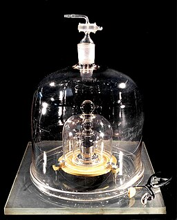

---
# Please do not edit this file directly; it is auto generated.
# Instead, please edit 03-design-principles.md in _episodes_rmd/
title: "Experimental Design Principles"
teaching: 0
exercises: 0
questions:
- "What are the core principles of experimental design?"
objectives:
- "The way in which a design applies treatments to experimental units and measures the responses will determine 1) what questions can be answered and 2) with what precision relationships can be described."
- "The core principles guiding the way are 1) replication, 2) randomization and 3) blocking."
keypoints:
- "Replication, randomization and blocking determine the validity and usefulness of an experiment."
source: Rmd
---

Variability is natural in the real world. A medication given to a group of 
patients will affect each of them differently. A specific diet given to a cage
of mice will affect each mouse differently. Ideally if something is measured 
many times, each measurement will give exactly the same result and will 
represent the true value. This ideal doesn't exist in the real world. For 
example, the mass of one kilogram is defined by the (https://en.wikipedia.org/wiki/International_Prototype_of_the_Kilogram)[International Prototype 
Kilogram], a cylinder composed of platinum and iridium about the size of a golf
ball. 

Copies of this prototype kilogram (replicates) are distributed worldwide so each 
country hosting a replica has its own national standard kilogram. None of the 
replicas measure precisely the same despite careful storage and handling. 
The reasons for this variation in measurements are not known. A kilogram in 
Austria differs from a kilogram in Australia, which differs from that in Brazil,
Kazakhstan, Pakistan, Switzerland or the U.S. What we assume is an absolute 
measure of mass shows real-world natural variability. Variability is also a 
natural part of every experiment we undertake.

## Replication
To figure out whether a difference in responses is real or inherently random, 
*replication* applies the same treatment to multiple experimental units. The
variability of the responses within a set of replicates provides a measure 
against which we can compare differences among different treatments. This 
variability is known as *experimental error*. This does not mean that something 
was done wrongly! It's a phrase describing the variability in the responses. 
Random variation is also known as *random error* or *noise*.  It reflects 
imprecision, but not inaccuracy. Larger sample sizes reduce this imprecision.

In addition to random (experimental) error, also known as noise, there are two
other sources of variability in experiments. *Systematic error* or bias, occurs 
when there are deviations in measurements or observations that are consistently 
in one particular direction, either overestimating or underestimating the true 
value. As an example, a scale might be calibrated so that mass measurements 
are consistently too high or too low. Unlike random error, systematic error is
consistent in one direction, is predictable and follows a pattern. Larger sample 
sizes don’t correct for systematic bias; equipment or measurement calibration 
does. *Technical replicates* define this systematic bias by running the same 
sample through the machine or measurement protocol multiple times to 
characterize the variation caused by equipment or protocols.

A *biological replicate* measures different biological samples in parallel to 
estimate the variation caused by the unique biology of the samples. The sample 
or group of samples are derived from the same biological source, such as cells, 
tissues, organisms, or individuals. Biological replicates assess the variability 
and reproducibility of experimental results. For example, if a study examines 
the effect of a drug on cell growth, biological replicates would involve 
multiple sets of cells from the same cell line to test the drug's effects. This 
helps to ensure that any observed changes are due to the drug itself rather than variations in the biological material being used. 

The greater the number of replications, the greater the precision (the closeness 
of two or more measurements to each other).  Having a large enough sample size 
to ensure high precision is necessary to ensure reproducible results.    

> ## Exercise 1: Which kind of error?
> A study used to determine the effect of a drug on weight loss 
> could have the following sources of experimental error. 
> Classify the following sources as either biological, 
> systematic, or random error.  
> 1). A scale is broken and provides inconsistent readings.  
> 2). A scale is calibrated wrongly and consistently measures mice 1 gram heavier.   
> 3). A mouse has an unusually high weight compared to its experimental group (i.e., it is an outlier).  
> 4). Strong atmospheric low pressure and accompanying storms affect instrument readings, animal behavior, and indoor relative humidity.  
>
> >
> > ## Solution to Exercise 1
> > 
> > 1). random, because the scale is broken and provides any kind of random reading it comes up with (inconsistent reading)  
> > 2). systematic  
> > 3). biological  
> > 4). random or systematic; you argue which and explain why
> > 
> {: .solution}
{: .challenge}

These three sources of error can be mitigated by good experimental design. 
Systematic and biological error can be mitigated through adequate numbers of 
technical and biological replicates, respectively. Random error can also be 
mitigated by experimental design, however, replicates are not effective. By 
definition random error is unpredictable or unknowable. For example, an 
atmospheric low pressure system or a strong storm could affect equipment 
measurements, animal behavior, and indoor relative humidity, which introduces 
random error. We could assume that all random error will balance itself out, and 
that all samples will be equally subject to random error. A more precise way to 
mitigate random error is through blocking. 

## Randomization
> ## Exercise 2: The efficient technician
> Your technician colleague finds a way to simplify and expedite an experiment.
> The experiment applies four different wheel-running treatments to twenty 
> different mice over the course of five days. Four mice are treated 
> individually each day for two hours each with a random selection of the four
> treatments. Your clever colleague decides that a simplified protocol would 
> work just as well and save time. Run treatment 1 five times on day 1, 
> treatment 2 five times on day 2, and so on. Some overtime would be required 
> each day but the experiment would be completed in only four days, and then 
> they can take Friday off! 
> Does this adjustment make sense to you?    
> Can you foresee any problems with the experimental results?   
>
> >
> > ## Solution to Exercise 2
> > 
> > Since each treatment is run on only one day, the day effectively becomes
> > the experimental unit (explain this). Each experimental unit (day) has five
> > samples (mice), but only one replication of each treatment. There is no 
> > valid way to compare treatments as a result. There is no way to separate
> > the treatment effect from the day-to-day differences in environment, 
> > equipment setup, personnel, and other extraneous variables.
> > 
> {: .solution}
{: .challenge}

Why should treatments be randomly assigned to experimental units? Randomization
minimizes bias and moderates experimental error (a.k.a. noise). A hat full of 
numbers, a random number table or a computational random number generator can be 
used to assign random numbers to experimental units so that any experimental 
unit has equal chances of being assigned to a specific treatment group. 

Here is an example of randomization using a random number generator. The study
asks how a high-fat diet affects blood pressure in mice. If the number is odd, 
the sample is assigned to the treatment group, which receives the high-fat diet.
If the random number is even, the sample is assigned to the control group (the 
group that doesn't receive the treatment, in this case, regular chow). 

~~~
# create the mouse IDs and 26 random numbers between 1 and 100
mouse_ID <- LETTERS
random_number <- sample(x = 100, size = 26)

# %% is the modulo operator, which returns the remainder from division by 2
# if the remainder is 0 (even number), regular chow diet is assigned
treatment <- ifelse(random_number %% 2 == 0, "chow", "high fat")
random_allocation <- data.frame(mouse_ID, random_number, treatment)
random_allocation
~~~
{: .language-r}

~~~
   mouse_ID random_number treatment
1         A            45  high fat
2         B             8      chow
3         C            11  high fat
4         D            28      chow
5         E            59  high fat
6         F             5  high fat
7         G            19  high fat
8         H            46      chow
9         I            30      chow
10        J            96      chow
11        K            67  high fat
12        L            62      chow
13        M            94      chow
14        N            69  high fat
15        O            87  high fat
16        P            72      chow
17        Q            76      chow
18        R            89  high fat
19        S            75  high fat
20        T             7  high fat
21        U            44      chow
22        V            52      chow
23        W           100      chow
24        X            65  high fat
25        Y            10      chow
26        Z            14      chow
~~~
{: .output}

This might produce unequal numbers between treatment and control groups. It 
isn’t necessary to have equal numbers, however, *sensitivity* (the true positive 
rate, or ability to detect an effect when it truly exists) is maximized when 
sample numbers are equal.

~~~
table(random_allocation$treatment)
~~~
{: .language-r}

~~~

    chow high fat 
      14       12 
~~~
{: .output}

To randomly assign samples to groups with equal numbers, you can do the 
following.

~~~
# place IDs and random numbers in data frame
equal_allocation <- data.frame(mouse_ID, random_number)

# sort by random numbers (not by sample IDs)
equal_allocation <- equal_allocation[order(random_number),]

# now assign to treatment or control groups
treatment <- sort(rep(x = c("chow", "high fat"), times = 13))
equal_allocation <- cbind(equal_allocation, treatment)
row.names(equal_allocation) <- 1:26
equal_allocation
~~~
{: .language-r}

~~~
   mouse_ID random_number treatment
1         F             5      chow
2         T             7      chow
3         B             8      chow
4         Y            10      chow
5         C            11      chow
6         Z            14      chow
7         G            19      chow
8         D            28      chow
9         I            30      chow
10        U            44      chow
11        A            45      chow
12        H            46      chow
13        V            52      chow
14        E            59  high fat
15        L            62  high fat
16        X            65  high fat
17        K            67  high fat
18        N            69  high fat
19        P            72  high fat
20        S            75  high fat
21        Q            76  high fat
22        O            87  high fat
23        R            89  high fat
24        M            94  high fat
25        J            96  high fat
26        W           100  high fat
~~~
{: .output}

You can write out this treatment plan to a comma-separated values (csv) file,
then open it in Excel and use it to record your data collection or just keep
track of which samples are randomly assigned which diet.

~~~
write.csv(equal_allocation, file = "random-assign.csv", row.names = FALSE)
~~~
{: .language-r}

> ## Discussion
> Why not assign treatment and control groups to samples in alphabetical order?  
> Did we really need a random number generator to obtain randomized equal groups?
>
> >
> > ## Solution 
> > 
> > 1). Scenario: One technician processed samples A through M, and a different 
> > technician processed samples N through Z. Might the first technician have
> > processed samples somewhat differently from the second technician? If so,
> > there would be a "technician effect" in the results that would be difficult
> > to separate from the treatment effect.
> > 2). Another scenario: Samples A through M were processed on a Monday, and 
> > samples N through Z on a Tuesday. Might the weather or the environment in
> > general have been different between Monday and Tuesday? What if a big
> > construction project started on Tuesday, or the whole team had a birthday
> > gathering for one of their members, or anything else in the environment 
> > differed between Monday and Tuesday? If so, there would be a 
> > "day-of-the-week effect" in the results that would be difficult to
> > separate from the treatment effect. 
> > 3). Yet another scenario: Samples A through M were from one strain, and 
> > samples N through Z from a different strain. How would you be able to 
> > distinguish between the treatment effect and the strain effect?
> > 4). Yet another scenario: Samples with consecutive ids were all sibling 
> > groups. For example, samples A, B and C were all siblings, and all assigned 
> > to the same treatment.  
> > All of these cases would have introduced an effect (from the technician, the 
> > day of the week, the strain, or sibling relationships) that would confound 
> > the results and lead to misinterpretation.
> > 
> {: .solution}
{: .challenge}

## Blocking
Experimental units can be grouped, or *blocked*, to increase the precision of
treatment comparisons. 

